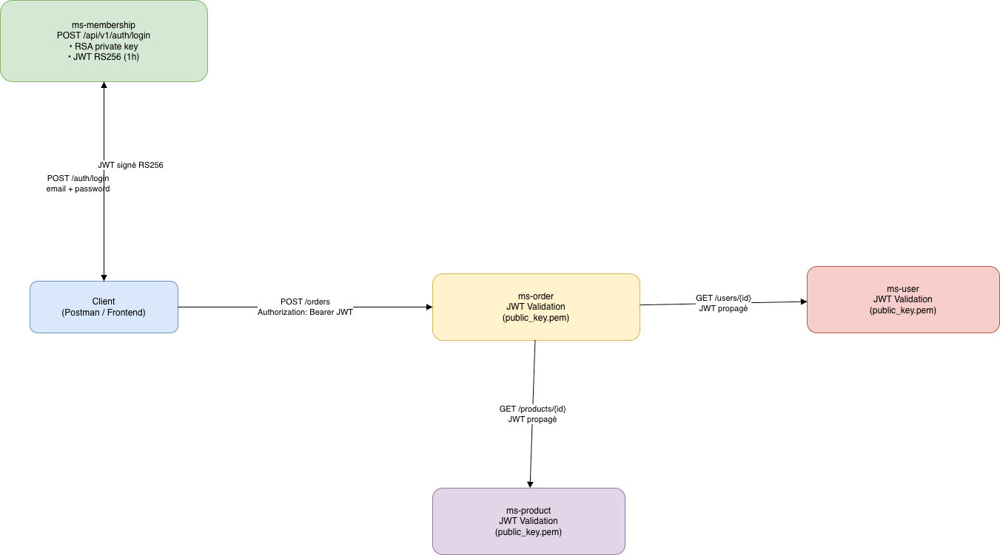

# Sécurisation JWT – Plateforme E-commerce

## 1. Architecture de sécurité

La plateforme e-commerce est sécurisée à l’aide de tokens JWT signés par chiffrement asymétrique RSA.

Le microservice **ms-membership** est responsable de l’authentification et de la génération des tokens JWT.  
Les microservices **ms-order** et **ms-product** valident les tokens JWT à l’aide de la clé publique RSA.

L’architecture est **stateless** : aucun token n’est stocké en base de données.

---

## 2. Flux d’authentification

1. Le client envoie ses identifiants (email, mot de passe) au service **ms-membership**.
2. Le service vérifie les informations utilisateur.
3. Un token JWT signé avec la clé privée RSA est généré.
4. Le token est renvoyé au client.
5. Le client appelle les endpoints protégés en fournissant le token dans le header HTTP :

Authorization: Bearer <token>

6. Les services **ms-order** et **ms-product** valident le token à chaque requête à l’aide de la clé publique RSA.

---

## 3. Diagramme de séquence

---

## 4. Format du JWT

### Header
{
  "alg": "RS256",
  "typ": "JWT"
}

### Payload
{
  "userId": 1,
  "email": "alice.dupont@example.com",
  "roles": ["USER"],
  "iat": 1700000000,
  "exp": 1700003600
}

---

## 5. Gestion des clés RSA

- Clé privée stockée dans ms-membership (`private_key.pem`)
- Clé publique partagée aux autres services (`public_key.pem`)
- Chargement des clés depuis des fichiers PEM au démarrage

---

## 6. Validation JWT côté services

- Extraction du token depuis le header Authorization
- Validation de la signature RSA
- Vérification de l’expiration
- Extraction des informations utilisateur

---

## 7. Gestion des erreurs

- 401 Unauthorized : token absent ou invalide
- 403 Forbidden : token expiré

---

## 8. Communication inter-services sécurisée

Le JWT est propagé entre services via le header Authorization.

---

## 9. Contraintes techniques respectées

- RSA (asymétrique)
- RS256
- Expiration 1h
- Stateless
