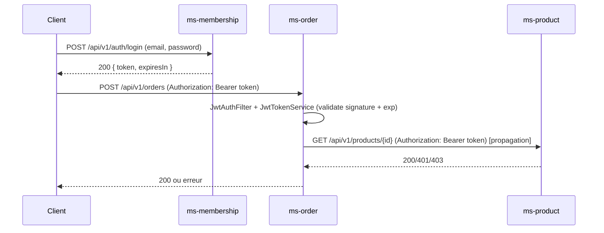

# SECURITY.md — TP2 Sécurisation JWT (RSA)

## 1) Architecture de sécurité (vue d’ensemble)

**Objectif :** authentifier les utilisateurs via **ms-membership**, puis sécuriser **ms-product** et **ms-order** en validant un **JWT signé en RSA (RS256)**.

### Data flow (TP2)

1. **Login**
   - Client → `POST /api/v1/auth/login` → **ms-membership**
   - ms-membership vérifie les identifiants (email + password)
   - ms-membership renvoie un JWT **signé avec la clé privée RSA**

2. **Accès aux ressources**
   - Client → `Authorization: Bearer <token>` → **ms-product / ms-order**
   - Les services valident le JWT **avec la clé publique RSA**
   - Si OK → 200
   - Si token absent/invalide → 401
   - Si token expiré → 403 (demande explicite du prof)

---

## 2) Diagramme de séquence (authentification)



---

## 3) Format du JWT

### Header
- `alg`: **RS256**
- `typ`: `JWT`

### Payload (claims utilisés)
Exemple de contenu attendu (ms-membership) :
```json
{
  "userId": 1,
  "email": "alice.dupont@example.com",
  "roles": ["USER"],
  "iat": 1700000000,
  "exp": 1700003600
}
```

### Signature
- Signature RSA (clé privée côté ms-membership)
- Vérification RSA (clé publique côté ms-order / ms-product)

---

## 4) Gestion des clés RSA

### Fichiers
- **ms-membership**
  - `src/main/resources/private_key.pem` (secret, sert à signer)
  - `src/main/resources/public_key.pem` (peut être partagé)
- **ms-order / ms-product**
  - `src/main/resources/public_key.pem` (sert à vérifier)

### Génération (exemple OpenSSL)
```bash
# 1) clé privée RSA 2048
openssl genpkey -algorithm RSA -out private_key.pem -pkeyopt rsa_keygen_bits:2048

# 2) extraction clé publique
openssl rsa -pubout -in private_key.pem -out public_key.pem
```

### Chargement côté services
- **ms-membership** charge la **clé privée** (bean `PrivateKey`) depuis `private_key.pem`
- **ms-order** charge la **clé publique** (bean `PublicKey`) depuis `public_key.pem`

---

## 5) Implémentation — où est fait quoi ?

### 5.1 ms-membership : génération du JWT

- **Endpoint login**
  - `AuthController` : `POST /api/v1/auth/login`
  - Valide email + mot de passe (bcrypt)
  - Génère le token + renvoie `{ token, expiresIn }`

- **Génération du token**
  - `JwtIssuerService.generateToken(userId, email, roles, expiresInSeconds)`
  - Ajoute les claims `userId`, `email`, `roles`
  - `exp` = now + 3600s (1 heure)
  - `signWith(privateKey, RS256)`

- **Clé privée**
  - `PrivateKeyConfig` : lit `private_key.pem` depuis le classpath et fabrique un `PrivateKey`

> Remarque : pour tester facilement **token expiré**, tu peux mettre temporairement `expiresIn = 5` secondes dans `AuthController`, puis remettre `3600` quand c’est validé.

---

### 5.2 ms-order : validation du JWT (clé publique)

- **Spring Security**
  - `SecurityConfig`
    - CSRF désactivé (API)
    - `SessionCreationPolicy.STATELESS` (stateless)
    - `/actuator/**` autorisé sans token
    - le reste → `.authenticated()`
    - ajout du filtre `JwtAuthFilter`

- **Filtre JWT**
  - `JwtAuthFilter` :
    1. extrait `Authorization: Bearer <token>`
    2. appelle `JwtTokenService.validate(token)`
    3. récupère `userId` + `roles` depuis les claims
    4. (optionnel mais utile) pose un `Authentication` dans `SecurityContextHolder`
    5. renvoie :
       - **401** si header manquant / token invalide
       - **403** si token expiré

- **Validation cryptographique**
  - `JwtTokenService` :
    - parse le JWT avec `publicKey` (RSA)
    - si `ExpiredJwtException` → `TokenExpiredException`
    - sinon → `TokenInvalidException`

- **Clé publique**
  - `PublicKeyConfig` : lit `public_key.pem` et fabrique le `PublicKey`

---

## 6) Communication inter-services sécurisée (Order → Product/User)

Quand **ms-order** appelle **ms-product** ou **ms-membership/users** :
- ms-order **propage le header Authorization** reçu du client
- si le service cible renvoie **401**, ms-order remonte une erreur dédiée (ex: `ServiceUnauthorizedException`), puis le `GlobalExceptionHandler` renvoie 401 côté client.

✅ **À vérifier** côté projet :
- `ProductClient` : ajoute `Authorization` dans les headers sortants
- `UserClient` : ajoute `Authorization` dans les headers sortants
- `GlobalExceptionHandler` : handler pour `ServiceUnauthorizedException` → 401

---

## 7) Gestion des erreurs (401 / 403)

### 401 Unauthorized
- token absent
- token invalide (signature KO, mauvais format, etc.)
- service cible rejette le token (inter-services)

### 403 Forbidden (demande prof)
- token expiré (`exp < now`)

---

## 8) Checklist TP2 (sécurité)

- [x] RSA (asymétrique), pas de clé symétrique
- [x] Algo JWT : RS256
- [x] Clés dans `private_key.pem` / `public_key.pem`
- [x] Expiration 1 heure (en prod)
- [x] Stateless (pas de stockage token en base)
- [x] Endpoints protégés (sauf `/actuator/**`)
- [x] 401 si token absent/invalide
- [x] 403 si token expiré
